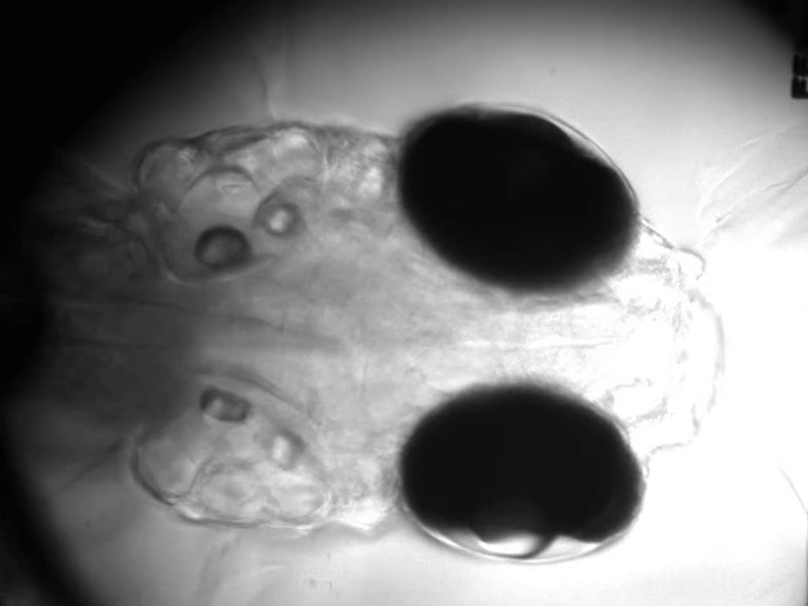
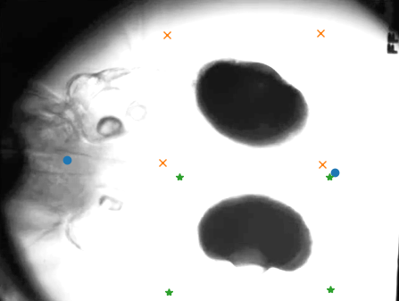
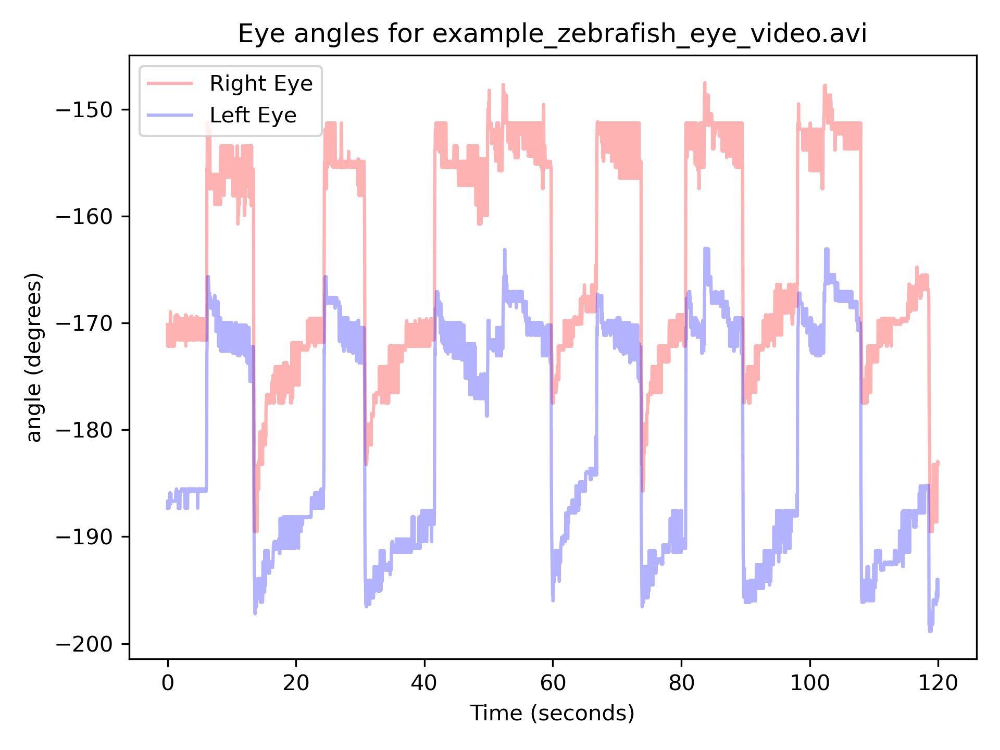

# Zebrafish Eye Tracker

Interactable zebrafish eye tracking package written by Lisa Bauer. 
This package uses a slightly modified version of [morphsnakes](https://pypi.org/project/morphsnakes/#description).

Includes example data and results which is run by tests/test_tracker.py 

---

## Installation

```bash
git clone https://github.com/lisakatobauer/eyetracker.git
cd eyetracker
pip install -e .
````


---

## Overview



*This eyetracker requires you to have a view similar to the one above. Contrast and resolution can be a lot worse, and it should still run quite well.*

---

## Tracker logic


### Step 1: Eye and midline selection

The process of finding the eye angles is based on first selecting the midline and right and left eye.



*Make sure to click which points you are selecting in the legend. Left click selects, right click undoes the selection.*


### Step 2: Fitting an ellipsoid to the eye

The tracking is based on using morphsnakes to fit an ellipsoid to your image, and fitting a line to the ellipsoid. 

There are several parameters that define your tracking outcome.
Below is a list of configurable parameters to fine-tune the eye tracker:

| Parameter             | Description                                      | Default Value |
|-----------------------|--------------------------------------------------|---------------|
| `brightness_modifier` | How many times to increase contrast              | `1.0`         |
| `downsample_factor`   | How many times the image is downsampled          | `10`          |
| `default_morph_iter`  | How many times you will iterate with morphsnakes | `35`          |
| `default_semi_axis`   | Expected size of eye ellipsoid (in pixels)       | `(50, 25)`    |

*Adjust these parameters when calling the main tracking functions to optimize performance for your dataset. You are most likely going to need to change the default semi axis based on what size your eye selection has. Generally, contrast needs to be enhanced at least to 5.*


### Step 3: Visualize and save results

View the eye tracking results. You have the option to automatically save the resulting plots.



---


## License

MIT License. See [LICENSE](LICENSE) for details.

---

## Contact

Created by [Lisa Bauer](https://github.com/lisakatobauer). Feel free to reach out!

